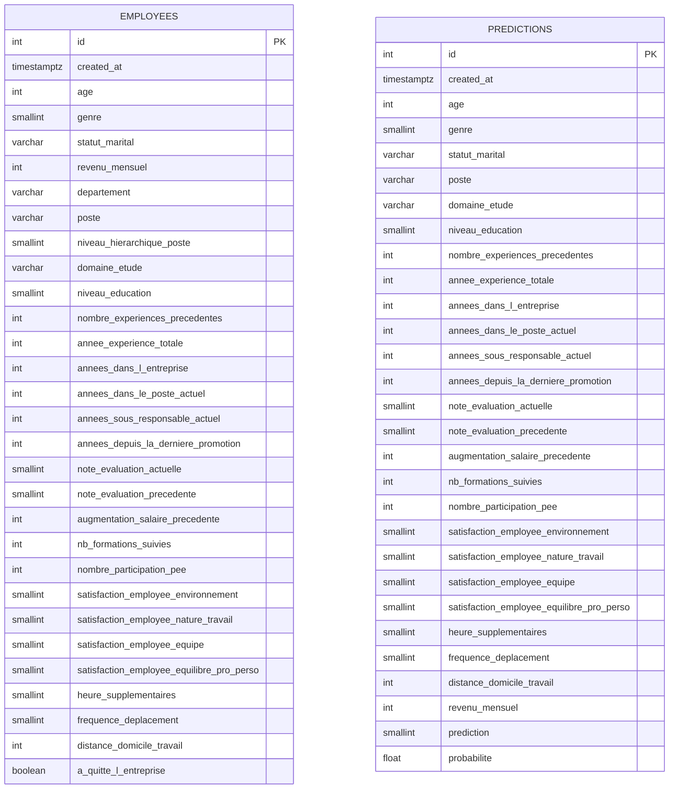

# Déployez un modèle de Machine Learning

## Description
API de déploiement d'un modèle de Machine Learning développée avec FastAPI.

## Structure du projet
```
mon-projet/
│
├── app/
│   ├── main.py
│   ├── routes/
│   │   └── predict.py
│   ├── schemas/
│   │   └── prediction.py
│   ├── db/
│   │   ├── models.py
│   │   ├── session.py
│   │   └── crud.py
│
├── ml_model/
│   ├── model.pkl
│   └── loader.py
│
├── scripts/
│   ├── create_db.py
│   └── schema.sql
│
├── tests/
│   ├── test_api.py
│   ├── test_model.py
│   └── test_db.py
│
├── .github/workflows/
├── requirements.txt
├── .gitignore
└── README.md
```

## Installation

### Prérequis
- Python 3.8+
- PostgreSQL

### Étapes
1. Cloner le repo
```bash
git clone git@github.com:RaphaelRIVIERE/ml-deployment-api.git
cd ton-repo
```

2. Créer et activer le venv
```bash
python3 -m venv venv
source venv/bin/activate
```

3. Installer les dépendances
```bash
pip install -r requirements.txt
```

## Configuration

Un fichier `.env.example` est fourni à la racine du projet. Il suffit de le copier et de renseigner ta clé API :

```bash
cp .env.example .env
```

Puis éditer `.env` et remplacer la valeur de `API_KEY` :

```
API_KEY=ta_clé_secrète
```

> **Sécurité** : Ne jamais committer `.env` (déjà listé dans `.gitignore`). Générer une clé robuste avec :
> ```bash
> python -c "import secrets; print(secrets.token_hex(32))"
> ```
> En CI/CD, injecter les secrets via **GitHub Actions Secrets** (Settings → Secrets and variables → Actions).

## Base de données

### ORM et connexion

- **ORM** : SQLAlchemy avec le style `declarative_base()`
- **Driver** : `psycopg2-binary` pour la connexion PostgreSQL
- **Lancement** : PostgreSQL via Docker (`docker-compose up -d`)

### Schéma des tables

#### `employees` — dataset complet (1470 lignes)

Stocke l'intégralité du dataset HR. La colonne `a_quitte_l_entreprise` est convertie de `"Oui"/"Non"` en `BOOLEAN`.

#### `predictions` — log des appels API

Enregistre chaque appel à `POST /predict` avec les inputs envoyés, les outputs retournés et un timestamp automatique (`created_at TIMESTAMPTZ`).

> Les deux tables sont **indépendantes** : les prédictions API ne référencent pas la table `employees` car les employés soumis à prédiction ne sont pas forcément dans le dataset.

### Diagramme UML



### Contraintes notables

| Colonne | Contrainte |
|---|---|
| `genre` | `SMALLINT` — `0` = Femme, `1` = Homme |
| `heure_supplementaires` | `SMALLINT` — `0` = Non, `1` = Oui |
| `frequence_deplacement` | `SMALLINT` — `0` = Aucun, `1` = Occasionnel, `2` = Fréquent |
| `a_quitte_l_entreprise` | `BOOLEAN` — converti depuis `"Oui"/"Non"` du CSV |
| `created_at` | `TIMESTAMPTZ` — posé par PostgreSQL (`server_default=func.now()`) |
| Scores satisfaction / évaluation | `SMALLINT` — valeurs entre `0` et `5` |

---

## Utilisation

### Lancer l'API

```bash
uvicorn app.main:app --reload
```

L'API est accessible sur `http://localhost:8000`.
La documentation interactive Swagger est disponible sur `http://localhost:8000/docs`.

### Authentification

Tous les endpoints (sauf `/health`) nécessitent une clé API passée dans le header HTTP :

```
X-API-Key: ta_clé_secrète
```

- Une requête sans clé ou avec une clé invalide retourne `401 Unauthorized`
- L'API refuse de démarrer si `API_KEY` est vide ou absent du `.env`
- Les secrets ne transitent jamais dans l'URL (header uniquement)

---

### Endpoints

#### `GET /health` — Health check

Vérifie que l'API est opérationnelle. Pas d'authentification requise.

```bash
curl http://localhost:8000/health
```

Réponse :
```json
{ "status": "ok", "message": "API opérationnelle" }
```

---

#### `GET /model/info` — Informations sur le modèle

Retourne les métadonnées du modèle déployé.

```bash
curl http://localhost:8000/model/info \
  -H "X-API-Key: ta_clé_secrète"
```

Réponse :
```json
{
  "algorithme": "Régression Logistique",
  "seuil": 0.4,
  "description": "Classification binaire — risque de départ RH (0 = Reste, 1 = Quitte)"
}
```

---

#### `POST /predict` — Prédiction du risque de départ

Envoie les features RH d'un employé et reçoit une prédiction de départ.

```bash
curl -X POST http://localhost:8000/predict \
  -H "X-API-Key: ta_clé_secrète" \
  -H "Content-Type: application/json" \
  -d '{
    "age": 35,
    "genre": 1,
    "statut_marital": "Marié(e)",
    "poste": "Consultant",
    "domaine_etude": "Infra & Cloud",
    "niveau_education": 3,
    "nombre_experiences_precedentes": 2,
    "annee_experience_totale": 10,
    "annees_dans_l_entreprise": 5,
    "annees_dans_le_poste_actuel": 2,
    "annees_sous_responsable_actuel": 3,
    "annees_depuis_la_derniere_promotion": 1,
    "note_evaluation_actuelle": 3,
    "note_evaluation_precedente": 3,
    "augmentation_salaire_precedente": 15,
    "nb_formations_suivies": 2,
    "nombre_participation_pee": 1,
    "satisfaction_employee_environnement": 3,
    "satisfaction_employee_nature_travail": 4,
    "satisfaction_employee_equipe": 3,
    "satisfaction_employee_equilibre_pro_perso": 2,
    "heure_supplementaires": 0,
    "frequence_deplacement": 1,
    "distance_domicile_travail": 10,
    "revenu_mensuel": 5000
  }'
```

Réponse :
```json
{
  "prediction": 0,
  "label": "Reste",
  "probabilite": 0.2341
}
```

**Champs de la réponse :**
| Champ | Type | Description |
|---|---|---|
| `prediction` | int | `0` = Reste, `1` = Quitte |
| `label` | string | `"Reste"` ou `"Quitte"` |
| `probabilite` | float | Probabilité de départ (entre 0 et 1) |

## Tests

### Lancer les tests

```bash
pytest tests/ -v
```

### Rapport de couverture

Affichage dans le terminal :
```bash
pytest tests/ --cov=app --cov-report=term-missing
```

Rapport HTML navigable (généré dans `htmlcov/`) :
```bash
pytest tests/ --cov=app --cov-report=term-missing --cov-report=html
```

### Résultat de couverture

Dernière mesure : **95%** (13 tests, 193 instructions)

| Fichier | Couverture |
|---|---|
| `app/db/crud.py` | 100% |
| `app/db/models.py` | 100% |
| `app/schemas/prediction.py` | 100% |
| `app/routes/predict.py` | 98% |
| `app/main.py` | 96% |
| `app/db/session.py` | 56% *(infrastructure PostgreSQL, non testée en isolation)* |


### Structure des tests

| Fichier | Contenu |
|---|---|
| `tests/conftest.py` | Fixtures partagées (client de test, payload valide) |
| `tests/test_api.py` | Tests des endpoints HTTP (health, predict, auth) |
| `tests/test_model.py` | Tests du pipeline ML (chargement, prédiction, seuil) |
| `tests/test_db.py`    | Tests de la couche base de données (CRUD, contraintes d'intégrité) |


## Déploiement

### URL publique

L'API est déployée sur Hugging Face Spaces :
- **API** : https://rriviere-attrition-api.hf.space
- **Documentation Swagger** : https://rriviere-attrition-api.hf.space/docs

### Pipeline CI/CD

Le déploiement est automatisé via GitHub Actions (`.github/workflows/ci_cd.yml`).

**Déclenchement** : à chaque push sur la branche `main`

**Étapes :**
1. **Test** — installation des dépendances + exécution de `pytest`
2. **Deploy** — si les tests passent, push automatique vers Hugging Face Spaces qui rebuild l'image Docker

**Secrets requis dans GitHub** (Settings → Secrets → Actions) :
| Secret | Description |
|---|---|
| `HF_TOKEN` | Token Hugging Face avec droits Write |
| `API_KEY` | Clé d'authentification de l'API |
| `DB_PASSWORD` | Mot de passe PostgreSQL |
