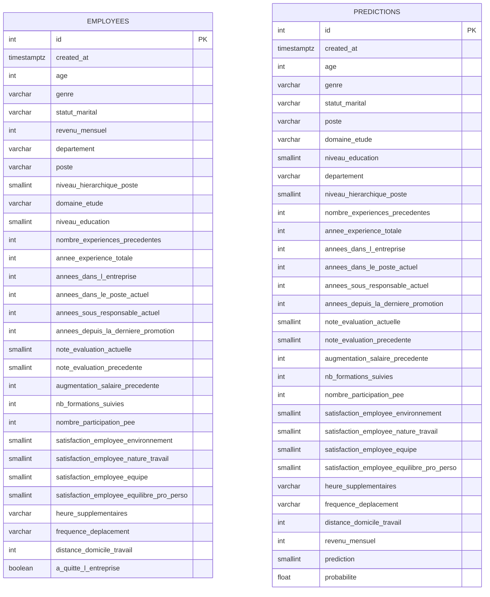

# API de prédiction d'attrition RH

## Description
API REST de prédiction du risque d'attrition RH développée avec FastAPI. Elle expose un modèle de Régression Logistique entraîné sur le dataset IBM HR Attrition (1470 employés), prédit la probabilité de départ d'un employé, et persiste chaque appel en base de données PostgreSQL pour des analyses ultérieures.


## Structure du projet
```
ml-deployment-api/
│
├── app/
│   ├── main.py
│   ├── routes/
│   │   └── predict.py
│   ├── schemas/
│   │   └── prediction.py
│   ├── db/
│   │   ├── models.py
│   │   ├── session.py
│   │   └── crud.py
│
├── ml_model/
│   ├── pipeline.pkl
│   ├── preprocessing.py
│   └── loader.py
│
├── scripts/
│   ├── create_db.py
│   ├── insert_data.py
│   └── query_db.py
│
├── tests/
│   ├── conftest.py
│   ├── test_api.py
│   ├── test_model.py
│   └── test_db.py
│
├── docs/
│   └── uml.png
│
├── data/
│   └── dataset.csv
│
├── examples/
│   └── predictions_sample.csv
│
├── .github/workflows/
│   └── ci_cd.yml
├── Dockerfile
├── docker-compose.yaml
├── requirements.txt
├── .env.example
├── .gitignore
└── README.md
```

## Installation

### Prérequis
- Python 3.12+
- Docker (pour PostgreSQL via docker-compose)

### Étapes
1. Cloner le repo
```bash
git clone git@github.com:RaphaelRIVIERE/ml-deployment-api.git
cd ml-deployment-api
```

2. Créer et activer le venv
```bash
python3 -m venv venv
source venv/bin/activate
```

3. Installer les dépendances
```bash
pip install -r requirements.txt
```

4. Lancer PostgreSQL
```bash
docker-compose up -d
```

5. Créer les tables
```bash
python scripts/create_db.py
```

6. Insérer le dataset
```bash
python scripts/insert_data.py
```

## Configuration

Un fichier `.env.example` est fourni à la racine du projet. Il suffit de le copier et de renseigner ta clé API :

```bash
cp .env.example .env
```

Le fichier `.env.example` contient les variables suivantes :

| Variable | Description | Valeur par défaut |
|---|---|---|
| `API_KEY` | Clé d'authentification de l'API | — |
| `DB_HOST` | Hôte PostgreSQL | `localhost` |
| `DB_PORT` | Port PostgreSQL | `5432` |
| `DB_USER` | Utilisateur PostgreSQL | — |
| `DB_PASSWORD` | Mot de passe PostgreSQL | — |
| `DB_NAME` | Nom de la base de données | `attrition_db` |

> **Sécurité** : Ne jamais committer `.env` (déjà listé dans `.gitignore`). Générer une clé robuste avec :
> ```bash
> python -c "import secrets; print(secrets.token_hex(32))"
> ```
> En CI/CD, injecter les secrets via **GitHub Actions Secrets** (Settings → Secrets and variables → Actions).

## Base de données

### ORM et connexion

- **ORM** : SQLAlchemy avec le style `declarative_base()`
- **Driver** : `psycopg2-binary` pour la connexion PostgreSQL
- **Lancement** : PostgreSQL via Docker (`docker-compose up -d`)

### Schéma des tables

#### `employees` — dataset complet (1470 lignes)

Stocke l'intégralité du dataset HR. La colonne `a_quitte_l_entreprise` est convertie de `"Oui"/"Non"` en `BOOLEAN`.

#### `predictions` — log des appels API

Enregistre chaque appel à `POST /predict` avec les inputs envoyés, les outputs retournés et un timestamp automatique (`created_at TIMESTAMPTZ`).

> Les deux tables sont **indépendantes** : les prédictions API ne référencent pas la table `employees` car les employés soumis à prédiction ne sont pas forcément dans le dataset.

### Diagramme UML



### Contraintes notables

| Colonne | Contrainte |
|---|---|
| `genre` | `VARCHAR` — `"M"` = Homme, `"F"` = Femme |
| `heure_supplementaires` | `VARCHAR` — `"Oui"` ou `"Non"` |
| `frequence_deplacement` | `VARCHAR` — `"Aucun"`, `"Occasionnel"` ou `"Fréquent"` |
| `a_quitte_l_entreprise` | `BOOLEAN` — converti depuis `"Oui"/"Non"` du CSV |
| `created_at` | `TIMESTAMPTZ` — posé par PostgreSQL (`server_default=func.now()`) |
| Scores satisfaction / évaluation | `SMALLINT` — valeurs entre `0` et `5` |

---

## Utilisation

### Lancer l'API

```bash
uvicorn app.main:app --reload
```

L'API est accessible sur `http://localhost:8000`.
La documentation interactive Swagger est disponible sur `http://localhost:8000/docs`.

### Authentification

Tous les endpoints (sauf `/health`) nécessitent une clé API passée dans le header HTTP :

```
X-API-Key: ta_clé_secrète
```

- Une requête sans clé ou avec une clé invalide retourne `401 Unauthorized`
- L'API refuse de démarrer si `API_KEY` est vide ou absent du `.env`
- Les secrets ne transitent jamais dans l'URL (header uniquement)

---

### Endpoints

#### `GET /health` — Health check

Vérifie que l'API est opérationnelle. Pas d'authentification requise.

```bash
curl http://localhost:8000/health
```

Réponse :
```json
{ "status": "ok", "message": "API opérationnelle" }
```

---

#### `GET /model/info` — Informations sur le modèle

Retourne les métadonnées du modèle déployé.

```bash
curl http://localhost:8000/model/info \
  -H "X-API-Key: ta_clé_secrète"
```

Réponse :
```json
{
  "algorithme": "Régression Logistique",
  "seuil": 0.4,
  "description": "Classification binaire — risque de départ RH (0 = Reste, 1 = Quitte)"
}
```

---

#### `POST /predict` — Prédiction du risque de départ

Envoie les features RH d'un employé et reçoit une prédiction de départ.

```bash
curl -X POST http://localhost:8000/predict \
  -H "X-API-Key: ta_clé_secrète" \
  -H "Content-Type: application/json" \
  -d '{
    "age": 35,
    "genre": "M",
    "statut_marital": "Marié(e)",
    "poste": "Consultant",
    "domaine_etude": "Infra & Cloud",
    "niveau_education": 3,
    "departement": "Ventes",
    "niveau_hierarchique_poste": 2,
    "nombre_experiences_precedentes": 2,
    "annee_experience_totale": 10,
    "annees_dans_l_entreprise": 5,
    "annees_dans_le_poste_actuel": 2,
    "annees_sous_responsable_actuel": 3,
    "annees_depuis_la_derniere_promotion": 1,
    "note_evaluation_actuelle": 3,
    "note_evaluation_precedente": 3,
    "augmentation_salaire_precedente": 15,
    "nb_formations_suivies": 2,
    "nombre_participation_pee": 1,
    "satisfaction_employee_environnement": 3,
    "satisfaction_employee_nature_travail": 4,
    "satisfaction_employee_equipe": 3,
    "satisfaction_employee_equilibre_pro_perso": 2,
    "heure_supplementaires": "Non",
    "frequence_deplacement": "Occasionnel",
    "distance_domicile_travail": 10,
    "revenu_mensuel": 5000
  }'
```

Réponse :
```json
{
  "prediction": 0,
  "label": "Reste",
  "probabilite": 0.2341
}
```

**Champs de la réponse :**
| Champ | Type | Description |
|---|---|---|
| `prediction` | int | `0` = Reste, `1` = Quitte |
| `label` | string | `"Reste"` ou `"Quitte"` |
| `probabilite` | float | Probabilité de départ (entre 0 et 1) |

## Tests

### Lancer les tests

```bash
pytest tests/ -v
```

### Rapport de couverture

Affichage dans le terminal :
```bash
pytest tests/ --cov=app --cov-report=term-missing
```

Rapport HTML navigable (généré dans `htmlcov/`) :
```bash
pytest tests/ --cov=app --cov-report=term-missing --cov-report=html
```

### Résultat de couverture

Dernière mesure : **95%** (13 tests, 193 instructions)

| Fichier | Couverture |
|---|---|
| `app/db/crud.py` | 100% |
| `app/db/models.py` | 100% |
| `app/schemas/prediction.py` | 100% |
| `app/routes/predict.py` | 98% |
| `app/main.py` | 96% |
| `app/db/session.py` | 56% *(infrastructure PostgreSQL, non testée en isolation)* |


### Structure des tests

| Fichier | Contenu |
|---|---|
| `tests/conftest.py` | Fixtures partagées (client de test, payload valide) |
| `tests/test_api.py` | Tests des endpoints HTTP (health, predict, auth) |
| `tests/test_model.py` | Tests du pipeline ML (chargement, prédiction, seuil) |
| `tests/test_db.py`    | Tests de la couche base de données (CRUD, contraintes d'intégrité) |


## Déploiement

### Environnements déployés

| Environnement | Branche déclenchante | URL |
|---|---|---|
| Production | `main` | https://rriviere-attrition-api.hf.space |
| Développement | `dev` | https://rriviere-attrition-api-dev.hf.space |

- **Documentation Swagger (prod)** : https://rriviere-attrition-api.hf.space/docs

### Pipeline CI/CD

Le déploiement est automatisé via GitHub Actions (`.github/workflows/ci_cd.yml`).

**Déclenchement** :
- Push sur `main` → tests + déploiement en **production**
- Push sur `dev` → tests + déploiement en **développement**

**Étapes :**
1. **Test** — installation des dépendances + exécution de `pytest`
2. **Deploy** — si les tests passent, push automatique vers Hugging Face Spaces qui rebuild l'image Docker

**Secrets** (Settings → Secrets → Actions) :
| Secret | Description |
|---|---|
| `HF_TOKEN` | Token Hugging Face avec droits Write |
| `API_KEY` | Clé API injectée dans HF Spaces |
| `DB_PASSWORD` | Mot de passe PostgreSQL injecté dans HF Spaces |

**Variables** (Settings → Variables → Actions) :
| Variable | Description |
|---|---|
| `HF_SPACE_PROD` | Nom du Space HF de production (ex : `username/space-name`) |
| `HF_SPACE_DEV` | Nom du Space HF de développement |

---

## Sécurité

### Mécanisme d'authentification

L'API utilise une authentification par clé API transmise dans le header HTTP `X-API-Key` :

```bash
curl http://localhost:8000/predict \
  -H "X-API-Key: ta_clé_secrète" \
  -H "Content-Type: application/json" \
  ...
```

- Seul l'endpoint `GET /health` est public (pas d'authentification requise)
- Une clé absente ou incorrecte retourne `401 Unauthorized`
- La clé ne transite jamais dans l'URL pour éviter les fuites dans les logs serveur

### Gestion des secrets

| Contexte | Mécanisme |
|---|---|
| Développement local | Fichier `.env` (non commité, voir `.env.example`) |
| GitHub Actions (CI/CD) | GitHub Secrets (Settings → Secrets → Actions) |
| Hugging Face Spaces | HF Variables / Secrets (Settings → Variables) |

Les secrets injectés au runtime sont : `API_KEY`, `HF_TOKEN`, `DB_PASSWORD`.

### Bonnes pratiques en production

- Toujours servir l'API derrière HTTPS (assuré par Hugging Face Spaces)
- Générer une clé robuste : `python -c "import secrets; print(secrets.token_hex(32))"`
- Rotation régulière de la clé API recommandée (re-déploiement nécessaire)
- Ne jamais committer `.env` (déjà listé dans `.gitignore`)

### Limitations actuelles (POC)

> Cette implémentation est acceptable pour un POC / projet démonstratif.

- La clé API est **statique et non hachée** : elle est comparée en clair en mémoire
- Pas de mécanisme de révocation ou d'expiration de token
- Pas de rate limiting (protection contre le bruteforce absente)
- En production réelle, préférer OAuth2 / JWT avec expiration

---

## Processus de stockage des données

### Flux complet d'un appel `/predict`

```
Requête HTTP (JSON)
    ↓
Validation Pydantic (PredictionInput)
    → Champs typés, valeurs bornées (ex : age entre 18 et 65)
    → Rejet 422 si données invalides
    ↓
Conversion en DataFrame pandas
    → Mise en forme compatible avec le pipeline scikit-learn
    ↓
Pipeline ML (predict_proba)
    → Retourne une probabilité entre 0 et 1
    → Seuil 0.40 appliqué : proba ≥ 0.40 → prediction = 1 (Quitte)
    ↓
Log obligatoire en base de données (table predictions)
    → Inputs + outputs + timestamp enregistrés systématiquement
    ↓
Réponse JSON (PredictionOutput)
```

> **Important** : chaque appel à `/predict` est **systématiquement loggé** en base de données avant le renvoi de la réponse. Il n'est pas possible d'obtenir une prédiction sans persistance.

### Rôle des deux tables

| Table | Contenu | Usage |
|---|---|---|
| `employees` | Dataset RH complet (1470 lignes) | Référence statique, utilisée pour l'entraînement initial du modèle |
| `predictions` | Log de chaque appel API | Traçabilité, analyse des prédictions, tableau de bord |

Les deux tables sont **indépendantes** : un employé soumis à prédiction n'a pas à exister dans `employees`.

---

## Performances du modèle

### Métriques d'évaluation

Le modèle est une **Régression Logistique** entraîné sur le dataset IBM HR Attrition.

| Métrique | Valeur |
|---|---|
| Recall (classe "Quitte") | 79%  |
| Précision (classe "Quitte") | 36%  |
| F1-score (classe "Quitte") | 49%  |
| PR-AUC | 59% |
| ROC-AUC | 83%  |

> Métriques évaluées sur le jeu de test (20% du dataset, stratifié).

### Justification du seuil 0.40

Le seuil de décision par défaut d'une régression logistique est 0.50. Il est ici abaissé à **0.40** pour :

- **Maximiser la sensibilité (recall)** : dans un contexte RH, il est préférable d'identifier trop d'employés à risque plutôt que d'en manquer (le coût de remplacement d'un employé est élevé)
- **Réduire les faux négatifs** : un employé prédit "Reste" qui part réellement est plus coûteux qu'une alerte inutile

Ce choix est un compromis volontaire entre précision et recall, justifié par le domaine métier.

### Protocole de mise à jour du modèle

Le modèle est actuellement statique (fichier `ml_model/pipeline.pkl` versionné dans Git).

Pour le réentraîner :
1. Exporter les nouvelles données depuis la table `predictions`
2. Réentraîner le pipeline scikit-learn sur les données enrichies
3. Sauvegarder le nouveau `pipeline.pkl`
4. Ouvrir une PR sur `main` → le CI/CD redéploie automatiquement le modèle

---

## Besoins analytiques

La table `predictions` constitue un **journal de bord structuré** de toutes les prédictions émises par l'API. Chaque ligne contient les inputs complets de l'employé, la prédiction, la probabilité associée et un horodatage automatique.

### Exemples de métriques exploitables

| Analyse | Champ(s) concerné(s) |
|---|---|
| Taux de churn prédit par département | `GROUP BY departement` sur `prediction = 1` |
| Évolution du risque dans le temps | `GROUP BY DATE_TRUNC('month', created_at)` |
| Profils à risque élevé (probabilité > 0.7) | `WHERE probabilite > 0.7` |
| Corrélation churn / heures supplémentaires | `GROUP BY heure_supplementaires` |
| Distribution par niveau hiérarchique | `GROUP BY niveau_hierarchique_poste` |

> Ces analyses peuvent alimenter un tableau de bord BI (Metabase, Superset, Power BI) connecté directement à la base PostgreSQL.
